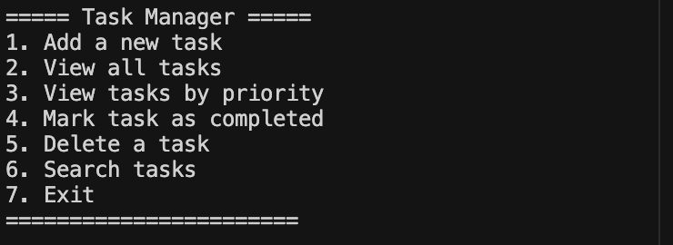

# Task Manager

A simple command-line task management application built in Python. This project demonstrates fundamental programming concepts including:

- Object-oriented programming
- Data structures (dictionaries, lists)
- File I/O operations
- Error handling
- Command-line interfaces

## Screenshot



## Features

- Add tasks with title, description, priority level, and due date
- View all tasks or filter by priority
- Mark tasks as completed
- Delete tasks
- Search for tasks
- Persistent storage using JSON
- Color-coded terminal output

## Project Structure

- `main.py`: Entry point for the application
- `task.py`: Defines the Task class
- `task_manager.py`: Manages the collection of tasks
- `utils.py`: Utility functions for the application
- `tasks.json`: Data storage file (created automatically)

## Requirements

- Python 3.6+
- No external dependencies (uses only standard library modules)

## Usage

1. Run the application:
   ```
   python main.py
   ```

2. Follow the on-screen menu to interact with the application

## Learning Points

This project demonstrates several key programming concepts:

- **Object-Oriented Programming**: Using classes to model tasks and their operations
- **Data Structures**: 
  - Dictionaries for efficient task storage and retrieval by ID
  - Lists for storing filtered tasks
  - Custom class for representing task objects
- **Algorithms**:
  - Sorting tasks by multiple criteria
  - Filtering tasks based on different conditions
  - Searching through tasks
- **File I/O**: Persistent storage using JSON serialization
- **Error Handling**: Try-except blocks for robust operation
- **User Interface**: Simple but effective command-line UI

## Future Improvements

- Add task categories or tags
- Implement recurring tasks
- Add support for notifications
- Create a simple GUI using Tkinter
- Add unit tests 